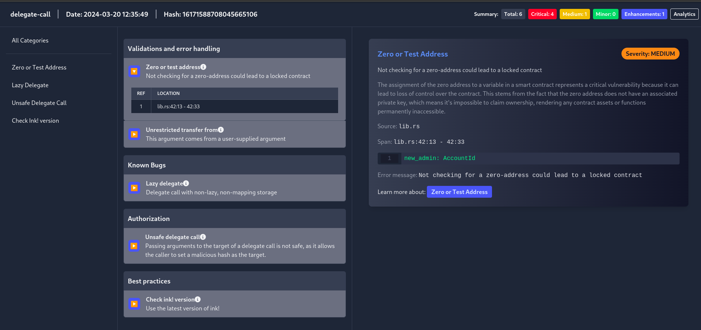
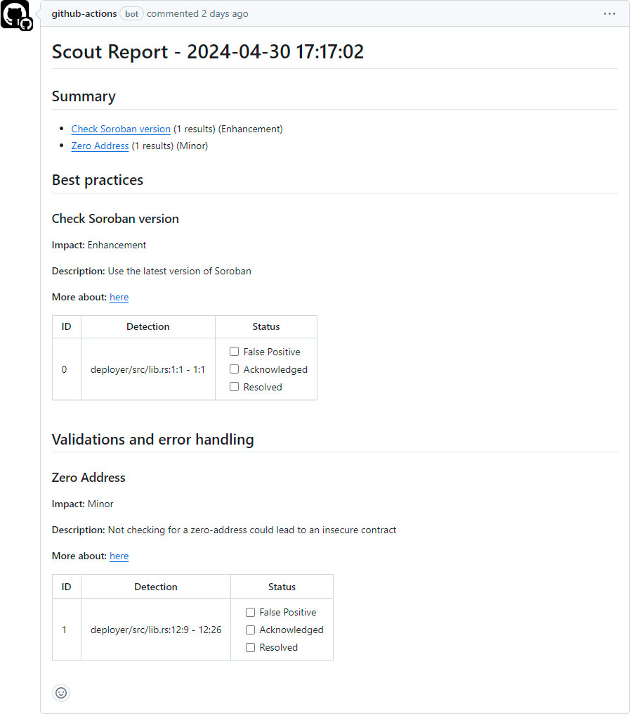
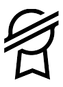
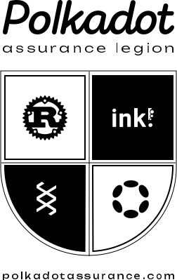

# Scout: Security Analysis Tool


<p align="center">
  
</p>

Scout is an extensible open-source tool intended to assist [ink!](https://use.ink/smart-contracts-polkadot/), [Soroban](https://stellar.org/soroban) and [Substrate](https://substrate.io/) developers and auditors detect common security issues and deviations from best practices.

This tool will help developers write secure and more robust smart contracts.

Our interest in this project comes from our experience in manual auditing and our usage of comparable tools in other blockchains. To improve coverage and precision, we´ll persist in research efforts on static and dynamic analysis techniques.

## Quick Start

Make sure that [Cargo](https://doc.rust-lang.org/cargo/getting-started/installation.html) is installed on your computer. Then, install Scout with the following command:

```bash
cargo install cargo-scout-audit
```

To run Scout on your project execute the following command:

```bash
cargo scout-audit
```

:bulb: Scout supports [Cargo Workspaces](https://doc.rust-lang.org/book/ch14-03-cargo-workspaces.html). When run on a workspace, Scout will be executed on all packages specified as members of the workspace.

:warning: Make sure that your smart contracts compile properly. Scout won't run if any compilation errors exist.

For more information on Scout's installation and usage, please refer to [Scout's documentation](https://coinfabrik.github.io/scout-audit/docs/intro).

## Output formats

You can choose the output format that best suit your needs (html or markdown). To specify the desired output run the following command:

```
cargo scout-audit --output-format [html|md|pdf|json|sarif]
```

**Example HTML report**



## Scout VS Code extension

Add Scout to your development workspace with Scout's VS Code extension to run Scout automatically upon saving your file.


:bulb: Tip: To see the errors highlighted in your code, we recommend installing the [Error Lens Extension](https://marketplace.visualstudio.com/items?itemName=usernamehw.errorlens).

:point_right: Download Scout VS Code from [Visual Studio Marketplace](https://marketplace.visualstudio.com/items?itemName=CoinFabrik.scout-audit).

## Scout GitHub Action

Integrate Scout into your CI/CD pipeline! Automatically run the tool against the targeted smart contracts. This immediate feedback loop allows developers to quickly address any issues before merging the code into the main branch, reducing the risk of introducing bugs or vulnerabilities.

**Scout output as a comment in a pull request**



:point_right: Find Scout GitHub Action in [GitHub Marketplace](https://github.com/marketplace/actions/run-scout-action).

## Tests

To validate our tool, we provide a set of code examples located in the test-cases folder.

In order to run the integration tests, navigate to apps/cargo-scout-audit and run:

```bash
cargo test --all --all-features
```

In order to run the tests for a particular test-case, run the same command on that particular test-case folder (e.g: test-cases/delegate-call/delegate-call-1/vulnerable-example).

## Detectors

Refer to Scout's [documentation site](https://coinfabrik.github.io/scout-audit/docs/intro) for a full list of the detectors for Ink, Soroban and Substrate.

## Acknowledgements

Scout is an open source vulnerability analyzer developed by [CoinFabrik's](https://www.coinfabrik.com/) Research and Development team.

We received support through grants from both the [Web3 Foundation Grants Program](https://github.com/w3f/Grants-Program/tree/master), the [Aleph Zero Ecosystem Funding Program](https://alephzero.org/ecosystem-funding-program), the [Stellar Community Fund](https://communityfund.stellar.org) and [Polkadot Assurance Legion](https://polkadotassurance.com/).

| Grant Program | Description |
|---------------|-------------|
|  | **Proof of Concept:** We collaborated with the [Laboratory on Foundations and Tools for Software Engineering (LaFHIS)](https://lafhis.dc.uba.ar/) at the [University of Buenos Aires](https://www.uba.ar/internacionales/index.php?lang=en) to establish analysis techniques and tools for our detectors, as well as to create an initial list of vulnerability classes and code examples. [View Grant](https://github.com/CoinFabrik/web3-grant) \| [Application Form](https://github.com/w3f/Grants-Program/blob/master/applications/ScoutCoinFabrik.md).<br><br>**Prototype:** We built a functioning prototype using linting detectors built with [Dylint](https://github.com/trailofbits/dylint) and expanded the list of vulnerability classes, detectors, and test cases. [View Prototype](https://coinfabrik.github.io/scout/) \| [Application Form](https://github.com/w3f/Grants-Program/blob/master/applications/ScoutCoinFabrik_2.md). |
|  | We improved the precision and number of detectors for the tool with a multi-phase approach. This included a manual vulnerability analysis of projects within the Aleph Zero ecosystem, comprehensive testing of the tool on leading projects, and refining its detection accuracy. |
|  | We added support for Stellar's smart contract language, Soroban. We included various output formats, such as an HTML report, improved the tool's precision and recall, and added a GitHub action to run the tool with pull requests.|
|  | We added support for Substrate pallets in all of Scout's features: CLI, VS Code extension and GitHub Action. |

## About CoinFabrik

We - [CoinFabrik](https://www.coinfabrik.com/) - are a research and development company specialized in Web3, with a strong background in cybersecurity. Founded in 2014, we have worked on over 180 blockchain-related projects, EVM based and also for Solana, Algorand, Stellar and Polkadot. Beyond development, we offer security audits through a dedicated in-house team of senior cybersecurity professionals, currently working on code in Substrate, Solidity, Clarity, Rust, TEAL and Stellar Soroban.

Our team has an academic background in computer science and mathematics, with work experience focused on cybersecurity and software development, including academic publications, patents turned into products, and conference presentations. Furthermore, we have an ongoing collaboration on knowledge transfer and open-source projects with the University of Buenos Aires.


## License

Scout is licensed and distributed under a MIT license. [Contact us](https://www.coinfabrik.com/) if you're looking for an exception to the terms.
