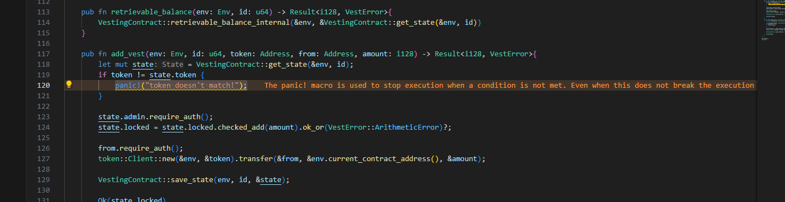
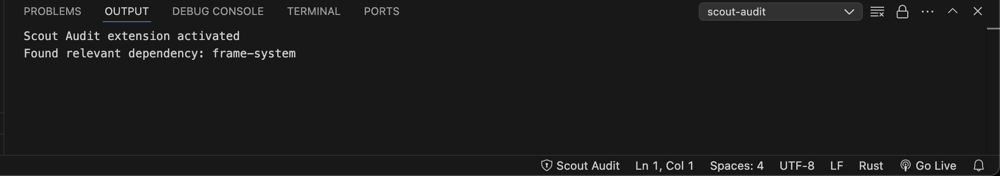
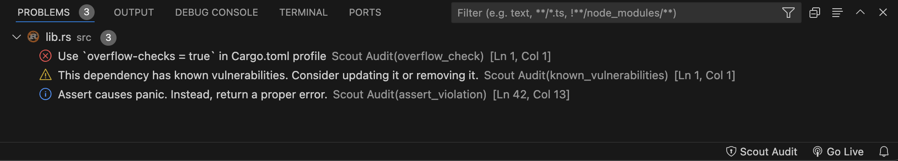

# Scout VS Code Extension

Add Scout to your development workspace with our VS Code extension and run Scout automatically upon saving your file.

## Usage

Once installed and enabled, the Scout Audit item appears in your VS Code status bar.

When you open a file that Scout can analyze, the Scout Audit item becomes enabled. Clicking it initiates the execution of Scout.

The Scout Audit Output window provides additional details, such as relevant dependencies detected, the workspace being analyzed, and any errors encountered during execution.

All findings from Scout are displayed in the Problems window.

:bulb: Tip: To see the errors highlighted in your code, we recommend installing the [Error Lens Extension](https://marketplace.visualstudio.com/items?itemName=usernamehw.errorlens).

:point_right: Download Scout VS Code from [Visual Studio Marketplace](https://marketplace.visualstudio.com/items?itemName=CoinFabrik.scout-audit).
